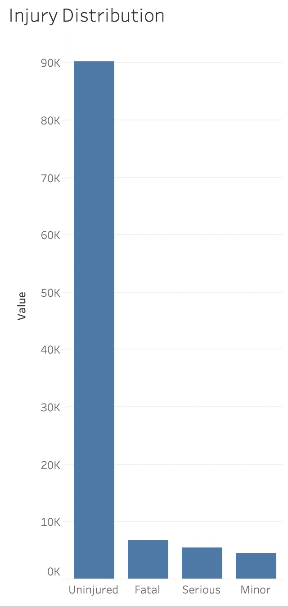

# Aviation Risk Analysis
## Overview
In this project, we explore the relevant risk factors to take into account when deciding how to enter the airplane market. 
## Business Understanding
Some of the factors that are taken into account are human safety, aircraft damage when there is an accident, and geographical risks for the company. For determining human safety, we explore the fatal to non-fatal ratio when an incident occur. This is explored from an airplane make perspective as well as a locational perspective. After determining an ideal make, we dig deeper to identify the model that would be more attractive to purchase. Finally, we determine high risk flying areas as well as safer areas that also provide a healthy market for entry into the aviation industry.
## Data Understanding and Analysis
Our source is an FAA dataset that provides information on aviation incidents since the 1940s. We are provided with data regarding the injury level of people, aircraft details,
aircraft damage, as well as locational data. 

Our dataset is concentrated in the US, so our analysis focuses on this market. Since the overwhelming majority of records show airplanes, we picked this type of aircraft to analyze in more detail.

Overall, flying is a very safe activity. Based on our findings, most airplane accidents result in the majority of people uninjured. But ideally, we want to hold human safety to the highest standard. To determine the safest planes, we analyzed which ones report the lowest fatality rate. We first split them into small and large airplanes, decide which one is safer, and then we find which models and makes within these two categories are better.

From a geographical perspective, we group the incidents by state. This helps us tell which states report more accidents, what kind of airplanes are predominantly used and how this affects the fatality for each of these locations. 
## Conclusion
What we are able to see is that commercial airplanes are much safer than private planes. With a considerably lower fatality rate and damage level, these aircrafts are the safest way to travel and will hold the least amount of damage if an accident were to happen. Among commercial airplanes, Boeing and Airbus have been the most popular pick of most airlines and it is justified by the safety they provide to the passengers.

We noticed that, in general, the amount of accidents is proportional to the population of the states. However, among the most populous states, we find some interesting differences of number of accidents as well as fatality percentage. Considering that New York and Florida have a similar population, New York records considerably less accidents and with a lower fatality percentage. Also, Illinois having in Chicago one of the busiest airports in the world, records one of the lowest fatality percentages in the United States and a fairly low number of accidents considering its population. On the other hand, less populated states that rely a lot on smaller airplanes, showed some of the highest fatality percentages. Since our data indicates that big commercial airplanes are the safest option, it would be better to avoid these states. 

One interesting data point is the state of Alaska. It reports a high number of accidents for its population. Nevertheless, the fatality percentage is not really high. More exploration would be needed, but considering the available data, it is an interesting market that flies a lot and may be in need of more airplane routes.

When entering the aircraft business, our recommendation would be to pick commercial airplanes over private planes. Boeing and Airbus are a strong option when considering the purchase of an airplane fleet. Finally, having headquarters in Chicago or New York City would provide a lot of demmand and safety for passengers. Finally, when developing routes, it would be good to prioritize the states our analysis showed have a higher use of large, commercial airplanes. 
